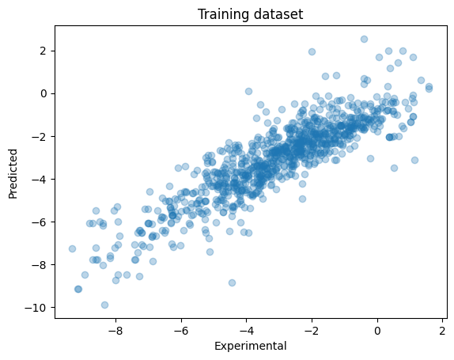
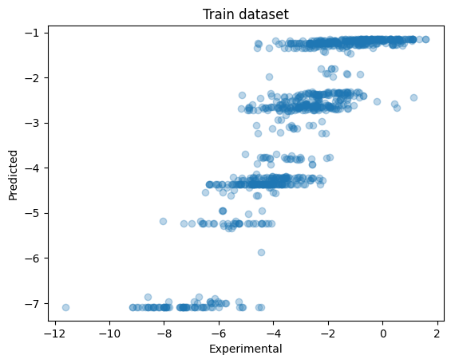

# Introduction to Data Science, Machine Learning and Artificial Intelligence
This repository contains the notes and codes for the Introduction to Data Science, Machine Learning and Artificial Intelligence course.
## Table of Contents
- [Introduction to Data Science, Machine Learning and Artificial Intelligence](#introduction-to-data-science-machine-learning-and-artificial-intelligence)
  - [Table of Contents](#table-of-contents)
  - [Data Science](#data-science)
  - [Models and Algorithms](#models-and-algorithms)
    - [KNN - K-Nearest Neighbors](#knn---k-nearest-neighbors)
    - [Linear Regression](#linear-regression)
    - [Random Forest Regression](#random-forest-regression)
  - [Datasets](#datasets)
## Data Science
## Models and Algorithms
### KNN - [K-Nearest Neighbors](./machine-learning//knn.ipynb)
- The labels must already be identified. This will be the different classses of the data points. 
- The predictors / features must be in numerical format. If not, then we need to convert them to numerical format (ex. [Label Encoding](https://www.geeksforgeeks.org/ml-label-encoding-of-datasets-in-python/)).
- Classify the data points based on the number of nearest neighbors (k), which is typically an odd number.
- The data point is classified based on the majority of votes from the k nearest neighbors.
- The distance between the data points is calculated using Euclidean distance.
### [Linear Regression](./machine-learning/linear_regression.ipynb)
- This works well with continuous numerical data.
- This aims to find the best fit line through computing the minimal sum of squared errors between the actual and predicted values.
- This can be evaluated using the following:
  -  Coefficient of determination (R^2). The R^2 measures how well the regression line fits the dataset. The higher the R^2, the better the regression line fits the dataset. 
  - Mean Squared Error (MSE). The mean squared error (MSE) measures the average of the squares of the errors(estimated values - actual values). The lower the MSE, the better the regression line fits the dataset.

### [Random Forest Regression](./machine-learning/linear_regression.ipynb)
- This is an ensemble learning method that uses multiple decision trees to predict the target variable.

## Datasets
| Dataset | Description | Source |
| --- | --- | --- |
| [Iris](./data/iris.csv) | This dataset contains the sepal and petal measurements of 3 different species of iris flowers. | [UCI Machine Learning Repository](https://archive.ics.uci.edu/ml/datasets/iris) |
| [Wine](./data/wine.csv) | This dataset contains the chemical composition of wines grown in the same region in Italy but derived from three different cultivars. | [UCI Machine Learning Repository](https://archive.ics.uci.edu/ml/datasets/wine) |
| [Star Classification](./data/star_classification.csv) | This is a dataset consisting of several features of stars. | [Kaggle](https://www.kaggle.com/datasets/deepu1109/star-dataset) |
| [Delaney Solubility](./data/delaney_solubility_with_descriptors.csv) | This dataset contains the chemical compounds and their solubility. | [Data Professor (Github)](https://github.com/dataprofessor/data/blob/master/delaney_solubility_with_descriptors.csv) |
| [Vehicle Dataset](./data/vehicle_dataset/) | This dataset contains information about used cars. This data can be used for a lot of purposes such as price prediction to exemplify the use of linear regression in Machine Learning. | [Kaggle](https://www.kaggle.com/datasets/nehalbirla/vehicle-dataset-from-cardekho) |